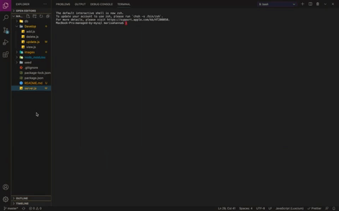
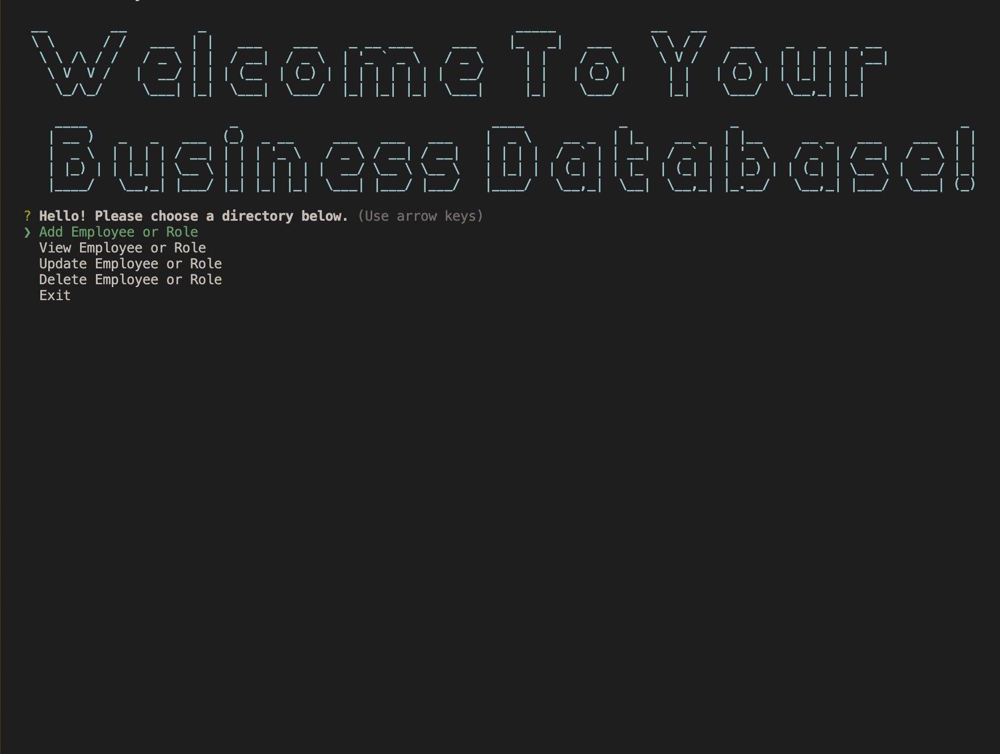

#   Managed By MYSQL

#   Description

    This project allows the user to view, add, update, or delete emplyoyees and departments directly from their CLI. The user's data is stored in a MYSQL database, and specific queries can be retrieved through user input.

#   Images

#   Video Link

[YouTube Link](https://youtu.be/lmRnt4YpCO4)

#  Languages Used

    *JavaScript
    *Node.js
    *MYSQL

#   Dependencies

    *npm inquirer
    *npm mysql
    *npm util
    *npm figlet
    *npm chalk
    *npm console.table

#   Installation

    *Open your command line
    *Run npm i
    *Run npm start

#   Contributors

    Marisa Hanna

